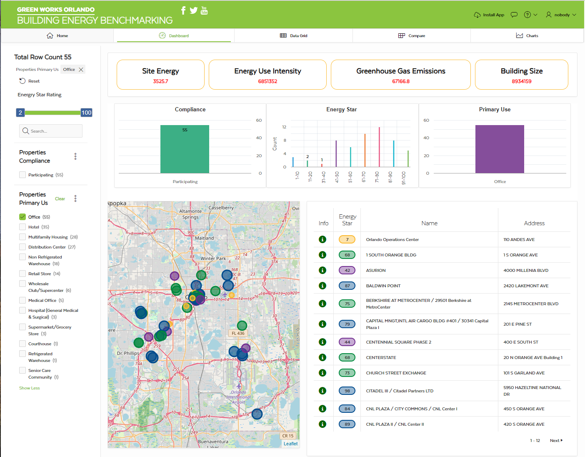
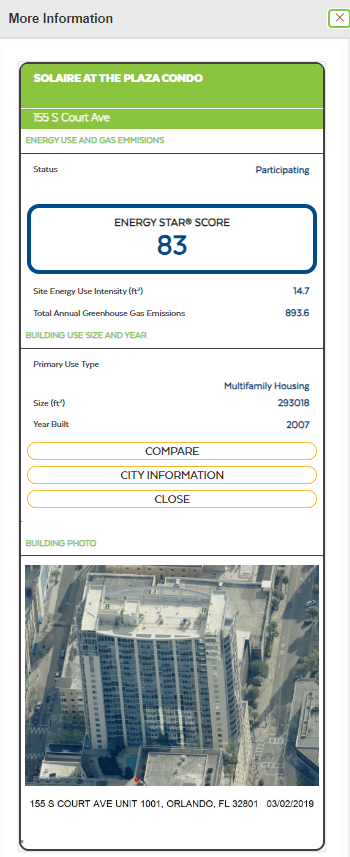

# Orlando Building Energy Benchmarking


Welcome to the **Orlando Building Energy Benchmarking** project! This project is part of the Orlando Greenworks initiative and aims to provide insight into the energy usage of Orlando buildings. Built using Oracle APEX, it includes interactive maps, comparison features, and visualizations to help analyze energy data over time.

## Table of Contents
- [Project Overview](#project-overview)
- [Features](#features)
- [Technology Stack](#technology-stack)
- [Installation](#installation)
- [Usage](#usage)
- [Screenshots](#screenshots)
- [Future Updates](#future-updates)
- [Contributing](#contributing)
- [License](#license)

## Live Site
Visit the live project site at [Orlando Building Energy Benchmarking Site](https://ge3f5e23966b519-apexuniversity.adb.us-ashburn-1.oraclecloudapps.com/ords/r/apex_university_workspace/orlando-building-energy-benchmarking11811110420002001/home)

## Project Overview
This app allows users to visualize energy usage data for buildings in Orlando. Its goal is to make energy data more accessible and understandable, foster awareness of energy consumption, and provide benchmarks for sustainability efforts.

### Key Goals:
- **Energy Benchmarking**: Analyze and visualize energy data across different buildings.
- **Interactive Map**: Users can explore energy data with an easy-to-navigate map.
- **Data Comparison**: Provides tools for comparing energy consumption across buildings over time.

## Features
- **Dashboard**: An overview of energy data with summary statistics and visualizations.
- **Interactive Map**: View energy usage data on a map of Orlando. Buildings are color-coded based on their energy consumption levels.
- **Comparison Tool**: Compare the energy performance of different buildings using graphs and charts.
**Additional Graphs**: This feature visualizes multiple years of energy data in a variety of formats (upcoming update).


## Technology Stack
- **Frontend**: HTML, CSS, JavaScript
- **Backend**: Oracle APEX, PL/SQL, SQL
- **Database**: Oracle Cloud Autonomous Database
- **Mapping**: OpenStreetMap integration

## Installation
To run this project locally:

1. Clone the repository:
    ```bash
    git clone https://github.com/MikeHodges-IT/ORACLE_APEX_Orlando_Building_Data.git
    ```
2. Inport the database using Oracle APEX 

3. Run the project using Oracle APEX.

## Usage
Once installed, the site will be accessible through your Oracle APEX instance. Users can interact with the map, compare building energy data, and view graphs and visualizations.

### Instructions:
- Navigate through the dashboard for an overview of energy data.
- Use the map to explore the energy consumption of various buildings.
- Compare energy performance on the comparison page to see how different buildings perform relative to each other.
  
## Screenshots
Here are a few previews of the application:

### Dashboard


### Comparison Page


### Data Grid


### Chart Page


### More Info Page


## Future Updates
In the near future, the following updates are planned:
- **Descriptions**: Add descriptions to the compare page and main page explaining who I am, what the app does, and key features.
- **Additional Graph**: Implement a new graph on the graph page to visualize energy data.
  
## Contributing
Feel free to fork this repository and submit pull requests. Contributions are welcome!

## License
This project is licensed under the MIT License.
